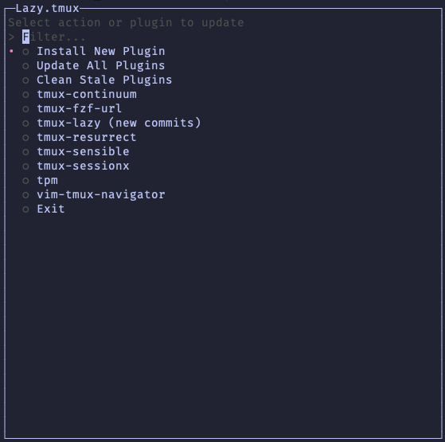

# Lazy.tmux

Lazy.tmux is a wrapper around [tpm](https://github.com/tmux-plugins/tpm)
that provides a more intuitive and nicer way to manage your Tmux plugins.

Lazy.tmux is inspired by [lazy.nvim](https://github.com/folke/lazy.nvim) if you're
using nvim and not using lazy.nvim, go give it a try!

Also huge shoutout to [sessionx](https://github.com/omerxx/tmux-sessionx) as it
encouraged me to create this plugin.



⚠️  WARNING: lazy.tmux is still in early development stages. Some unintended behavior might occur.
If you encounter any issue, please report it so I may fix it.

## 📜 Prerequisites

- [tpm](https://github.com/tmux-plugins/tpm)
- [gum](https://github.com/charmbracelet/gum)

## 📥 Installation

Add this to your `.tmux.conf` and run `Ctrl-I` for TPM to install the plugin.

```conf
set -g @plugin 'IdoKendo/tmux-lazy'
```

This is going to be the last time you need to do this 😉.

## ⚙️  Configuration

The default binding to open lazy.tmux is `<prefix>+Z`
You can change it by adding this line with your desired key:

```bash
set -g @lazy-tmux-binding '<mykey>'
```

## 🔐 Lockfile

Once you start using Lazy.tmux a new file will be generated alongside your `tmux.conf`
under the name `lazy.tmux.lock` - If you are storing your config in version control,
it is recommended that you store the lockfile as well, as it will allow you to restore
plugins to the very same version that you have in case future breaking change happens.

## 🕹️ Usage

Launching lazy.tmux opens a "pop up" with an input dialog for actions and installed plugins.
You can type the action that you want or the plugin that you wish to update and click Enter.

Available options:

- `Install` will open a text box to add a new plugin to your tmux.conf file
- `Remove` will open a text box to remove an existing plugin from your tmux.conf file and delete it from your system.
- `Update` will update all plugins currently installed and update the lockfile.
- `Sync` will sync the plugins to a lockfile in order to revert updates.
- `Clean` will delete artifacts of plugins that are not currently in-use.
- Selecting any plugin name will update it to its latest version.
Note that `(new commit)` tag will appear on plugins that have new commits. This will also update the lockfile.
- `Exit` will close lazy.tmux; This is also possible by clicking the `Esc` key.
